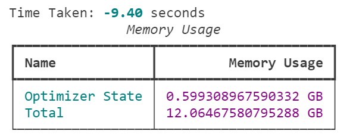
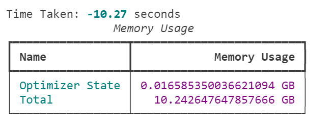
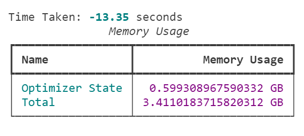
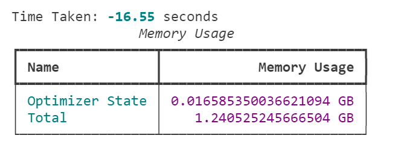

# QM9 `eps_LUMO`

## LoRA Setup

- LoRA applied to **all dense layers**.
- LoRA learning rate is set to 2.0e-4.
- LoRA Bias: With and without

## Performance Testing Methodology
- Run 100 steps of training.
- Every 25 steps, measure the metrics.
- Report the average.

### Base

### LoRA

- **37x** reduction in optimizer state memory usage.
- **9%** increase in training time.

### Base + Gradient Checkpointing

- **3x** reduction in total memory usage.
- **42%** increase in training time.

### LoRA + Gradient Checkpointing

- **9.8x** reduction in total memory compred to base.
- **76%** increase in training time.

